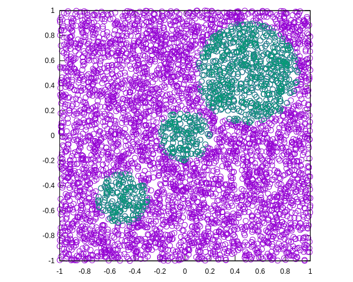

# Introduction

Point quadtrees implementation following [FinkelBentley]

# Install

    (cd lib && make)
    (cd example && make)

# References

- Finkel, R. A., & Bentley, J. L. (1974). Quad trees a data
structure for retrieval on composite keys. Acta informatica, 4(1),
1-9.
